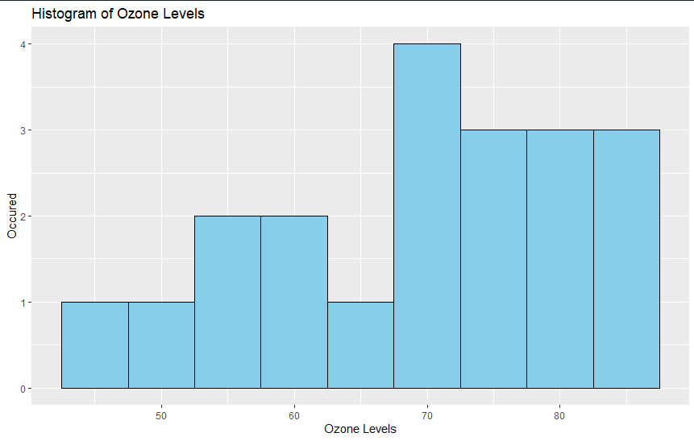
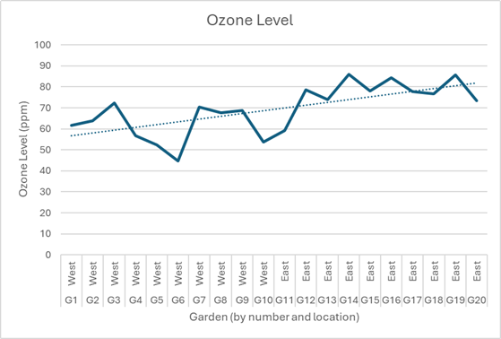

# Ozone Level Statistical Analysis in R

## Overview

This project analyzes ozone levels across botanical gardens using statistical methods in R to determine whether environmental location impacts ozone concentration. A two-sample t-test and data visualization techniques were used to evaluate patterns in the dataset.

## Objective

To evaluate whether ozone levels differ significantly based on garden location and to test hypotheses using t-tests.

## Methods

* Loaded and explored ozone dataset
* Assessed data distribution using histograms
* Conducted a one-sample t-test to compare ozone levels against a baseline value
* Interpreted statistical significance

## Tools Used

* R
* ggplot2
* Statistical testing (t-test)

## Results Overview

* Data visualization showed the distribution of ozone levels
* Statistical testing provided insight into whether ozone levels exceeded expected thresholds

## Graphs

## Files

* `teare_jack_finalproject.Rmd` — full analysis with code and explanations
* `data/` — dataset used in analysis
* `plots/` — generated visualizations
* `report/` — written project summary

## What I Learned

* Applying statistical tests to environmental datasets
* Data visualization using ggplot2
* Structuring reproducible analyses in R Markdown

